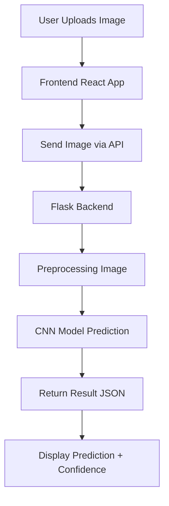
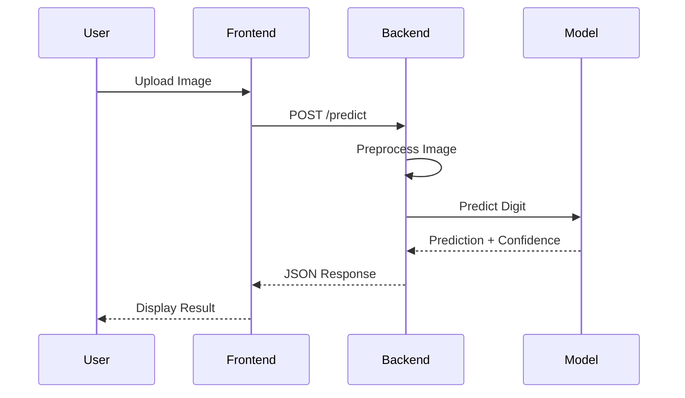

# 🚀 AI Digit Recognizer

A full-stack AI web application that predicts handwritten digits using a Convolutional Neural Network (CNN).

---

## 🎯 How It Works (Flow Overview)



---

## 🧠 System Architecture


---

## 🎨 Application Workflow (Step-by-Step)



---

## ✨ Features

* 📤 Upload handwritten digit image
* 🤖 AI predicts digit instantly
* 📊 Confidence score display
* 🎨 Modern animated UI
* ⚡ Fast API response
* 🧠 Deep Learning powered

---

## 🧠 Model Details

| Component   | Description                   |
| ----------- | ----------------------------- |
| Dataset     | MNIST                         |
| Input Shape | 28×28×1                       |
| Layers      | Conv → Pool → Flatten → Dense |
| Activation  | ReLU, Softmax                 |
| Loss        | Categorical Crossentropy      |
| Optimizer   | Adam                          |

---

## 🏗️ Tech Stack

### 🎨 Frontend

* React (Vite)
* Tailwind CSS
* Framer Motion
* Axios

### ⚙️ Backend

* Flask
* TensorFlow / Keras
* NumPy
* Pillow

---

## 📁 Project Structure

```bash
YourProject/
├── Frontend/
│   ├── src/
│   └── package.json
│
├── Backend/
│   ├── app.py
│   ├── model/
│   │   └── mnist_cnn.h5
│   └── requirements.txt
│
├── README.md
└── .gitignore
```

---

## ⚙️ Setup Guide

### 🔹 Backend

```bash
cd Backend
python -m venv venv
venv\Scripts\activate
pip install -r requirements.txt
python app.py
```

---

### 🔹 Frontend

```bash
cd Frontend
npm install
npm run dev
```

---

## 🔗 API Endpoint

### POST `/predict`

```json
{
  "prediction": 4,
  "confidence": 0.97
}
```

---

## ⚠️ Important Notes

* Input must be:

  * Grayscale
  * 28×28
  * White digit on black background

* Improper input → low accuracy

---

## 📊 Performance

* ~98–99% accuracy on MNIST
* Lower accuracy on real-world images (can be improved with preprocessing)

---

## 🚀 Future Improvements

* ✏️ Drawing canvas (like MNIST input)
* 🌐 Cloud deployment
* 📱 Mobile app version
* 🔍 Advanced preprocessing

---

## 💡 Key Learnings

* CNN for image classification
* Image preprocessing importance
* Full-stack AI integration
* API communication

---

## 👨‍💻 Author

**Ansh Patoliya**
AI & ML Enthusiast

---

⭐ Star this repo if you found it useful!
